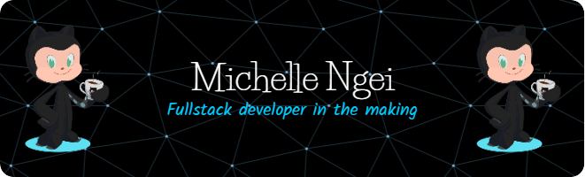

<!--
**MICHELLENGEI/MICHELLENGEI** is a ✨ _special_ ✨ repository because its `README.md` (this file) appears on your GitHub profile.

Here are some ideas to get you started:

- 🔭 I’m currently working on ...
- 🌱 I’m currently learning ...
- 👯 I’m looking to collaborate on ...
- 🤔 I’m looking for help with ...
- 💬 Ask me about ...
- 📫 How to reach me: ...
- 😄 Pronouns: ...
- ⚡ Fun fact: ...
-->

Welcome to my profile!😄😄 I'm all about building websites. I know my way around HTML, CSS, JavaScript, and SQL. 

Basically, I can make stuff look good and work smoothly. Whether it's creating cool designs with HTML and CSS or adding interactive features with JavaScript, I've got you covered. 

Plus, I'm pretty good at managing data with SQL, so your information stays organized and accessible. Let's team up and make something awesome together!

I’m currently learning.....React! 🚀 Can't wait to explore this exciting technology and see what awesome things I can create with it. Let's embark on this journey of discovery together! 🌟

  

 **Languages and tools:**  

<code></code>
<code></code>
<code></code>
<code></code>

<!-- <code></code>
<code></code> 
<code></code>-->

<!-- <h3 align="center">Connect with me:</h3>

 -->

<h3 align="center">My Github stats </h3>

<h3 align="center">Streaks Corner </h3>

  

